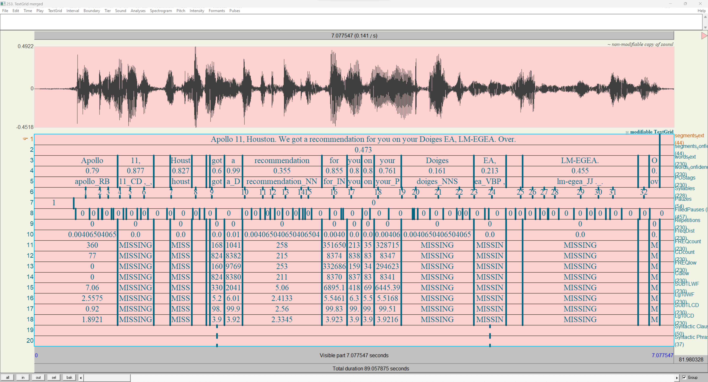
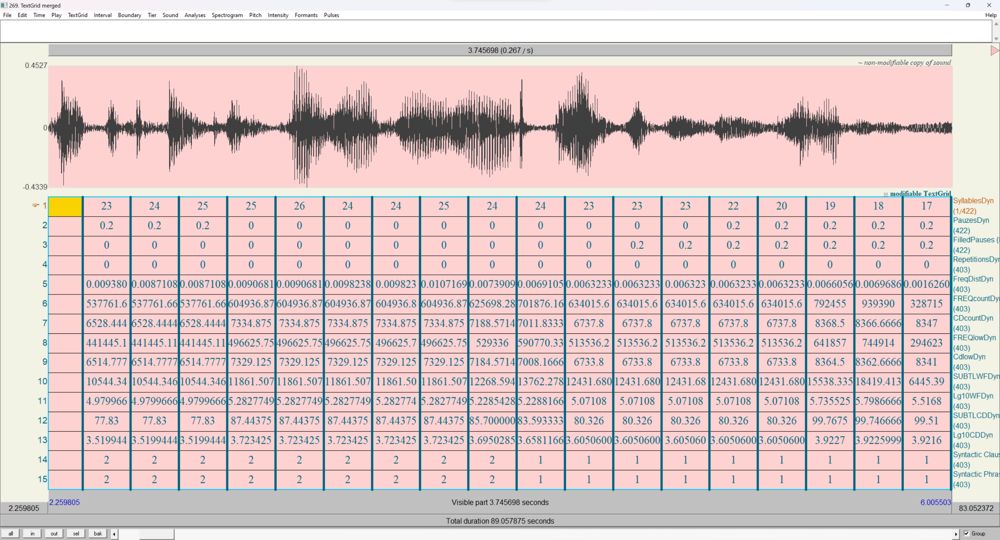
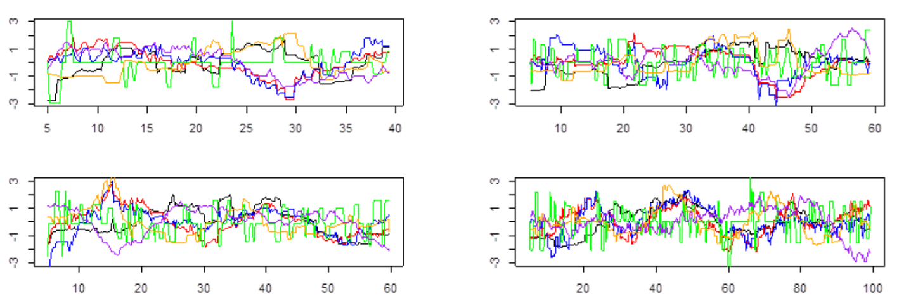

# DynamicFluency
DynamicFluency is a system designed to help researchers monitor and understand the dynamicity of linguistic aspects in (L2) speech, written at Leiden University as a small research grant project, as part of research by N. H. de Jong, J. Pacilly, and J. J. W. Roeloffs.

Modern methods for assessing the competence of second-language speakers tend to spit out one value at the end of the entire input. This causes the loss of information, as it is effectively averaging over time. Maybe a lot of mistakes were made in one small sentence out of the whole, or maybe a learning slowly improves over time, as the assignment progresses. By tracking a speaker's competence dynamically, DynamicFluency aims to provide methods for researching things like this.

The main, overarching, part of the system is written in [Praat](https://github.com/praat/praat), which users are presumed to be familiar with. Though it does function out-of-the-box, scripts are meant to be modified by the user to match their needs. This praat system interfaces with some Python code and modules, to be found under [DynamicFluency-core](https://github.com/JJWRoeloffs/DynamicFluency-core), that provide the interface to [NLTK](https://github.com/nltk/nltk) and other python dependencies. Though this can also be modified and changed, users are less expected to do so. 

### How it works

The system effectively consists of two parts: the first part gathers competence measures of the input speech, and puts it into a TextGrid. In Praat, this could, for example, look a little like this:

<p allign="center">
  
</p>

After this, the second part processes this data, and performs a sliding-window average over it, generating a list of evenly spaced-out data points. This data is saved both as a TextGrid and as a Praat table.

<p allign="center">
  
</p>

Finally, this data can then be processed, for example in R, to perform any wanted analysis. For example, here are four graphs that track 3 methods of complexity (both syntactic and semantic) and 3 measures of fluency.

<p allign="center">
  
</p>

## Installation

### Dependencies
* Praat
    * The system was only tested in the latest versions at the time. At the time of writing, that is 6.3.20
* Python
    * All Python versions greater or equal to 3.9 are tested and should work.
    * The command-line executable you want to use has to be specified in the settings, as well as while installing. For the rest of the README, this executable will be referred to as `[python-executable]`
        * Likely, this will be `python3` on Unix, and `py -3.11` on Windows
    * Some dependencies have to be installed with pip for the installation process.
        * Install pip on old python versions with `[python-executable] -m ensurepip --default-pip`
    * If Praat is launched from the terminal with `praat --open dynamicfluency.praat`, venvs are respected.

#### Optional Dependencies
* [Aeneas](https://github.com/readbeyond/aeneas)
    * This is a project that can do force-alignment. [WebMAUS](https://clarin.phonetik.uni-muenchen.de/BASWebServices/interface/WebMAUSBasic) (Called Maus for the rest of the README) and [transcribe-allign-textgrid](https://github.com/JJWRoeloffs/transcribe_allign_textgrid) (Called Whisper for the rest of this README), are also supported, but Aeneas is the only one that can natively integrate.
    * This project only works on python2.7 on Windows, and 3.7 on Unix. For this, the system expects executables `py -2.7` and `python3.7` to work, respectively.
    * This README will not explain how to get Aeneas running. Instead, please check out [The Aeneas-installer](https://github.com/sillsdev/aeneas-installer), and be warned it might take a while.

Once the dependencies are installed, the core Python package, [DynamicFluency-core](https://github.com/JJWRoeloffs/DynamicFluency-core), can be installed. Do this with:

```sh
[python-executable] -m pip install --upgrade dynamicfluency
```
When installed like this, the most recent version of the library is installed. However, it should be noted that the current version of the Praat scripts requires at least version 0.2.0 to function properly.

After this, go to [releases](https://github.com/JJWRoeloffs/DynamicFluency/releases) and download the .zip containing all the praat code and additional data. Once the .zip is extracted, everything should be ready for usage.

## Usage

Once DynamicFluency is installed, it can be run by running the `dynamicfluency.praat` script. This script cannot be moved out of its context, as it depends on the `configurationwizard.praat` and others in the `scripts` directory to be in the same relative position.

On startup, the script will ask if you want to run `configurationwizard.praat`. That script will create a `configuration.txt` file (or whatever other file name you specified) that contains the settings to be used. You can save and reuse these files for replication. If the configuration wizard is run, this script will create and possibly overwrite the specified file, and then run the main system with that configuration. If it is not run, the system will simply read the specified file and run with that configuration. To create a config file without running, run `configurationwizard.praat` separately. This configuration file might not work across different systems (e.g. created on Windows, executed on Mac), because of file path differences (Unix uses forward slashes, Windows backward slashes.) Editing the configuration.txt file by hand to replace file paths should solve any system independence issues.

Next to a configuration file, the system requires input files to run on. These are the audio files and the transcription files associated with those audio files. In the settings wizard, `input_file_spec` asks you to specify the location of these input files, where you specify the glob for the audio files, and the system looks for transcription files with the same name, but a different extension (.TextGrid or sometimes .txt). 

To get a transcription file, you can use [Maus](https://clarin.phonetik.uni-muenchen.de/BASWebServices/interface/WebMAUSBasic) or [Whisper](https://github.com/JJWRoeloffs/transcribe_allign_textgrid), both of which produce their output in the right format. If you have Aeneas configured, this transcription file is instead a non-aligned TextGrid (containing one tier with one interval with the entire sentence), or a .txt with a single line of text that is the transcription. Which one of these you use has to be specified in the configuration.

Upon installation, the downloaded files include a `configuration.txt` and sample data audio/transcription files that allow for running the system immediately on Windows, without running the configuration wizard.

The output will be in a directory separate from the input. This output directory is presumed to be empty. If it finds anything, it will show a prompt asking to be allowed to remove *all* files in that directory, canceling the script if you don't want that. For each input file pair, the system will output a lot of different TextGrids, these are the outputs of the individual components. One of them ends in `.merged.TextGrid`. This is the file that contains all the output. 

If, at any point during operation, you notice that praat stops its operation in a way that makes it look like there is nonsensical code in DynamicFluency itself, this is what happens if one of the Python scripts fails (There is no way to detect a python script failing while interfacing it with praat as far as I am aware e.g. catching the error,) therefore, if this happens, you should debug the python scripts from the command-line directly. One thing here that is known to cause issues is downloading the NLTK / Spacy models, which sometimes fails to register the needed data, or fails to download it. If this happens, it might be needed to run a separate Python script that downloads the needed libraries separately. This script is installed together with [DynamicFluency-core](https://github.com/JJWRoeloffs/DynamicFluency-core#download_models), and is called `download_models`. Look at the readme of that project for its documentation.


The resulting Textgrids and tables will contain the following tiers/columns:
| Tier |  Type | Component | |
| --- | --- | --- | --- |
Force-alignment tiers | Interval | Input | The tiers generated by the aligner
POStags | Interval | NLTK / SpaCy.| Force-aligned words, concatenated with their POS
Syllables | Point | Uhm-o-meter | Syllable Nuclei, used for finding filled pauses
Pauzes | Interval | Uhm-o-meter | Longer (between-utterance) pauzes
FilledPauzes | Interval | Uhm-o-meter | Filled pauses. (e.g. uh, uhm)
Repetitions | Interval | Custom | a number scaling from 0 (never used before) to 1 (the same as the previous word)
FreqDist | Interval | NLTK | Relative frequency distribution of words over the file
Frequency Tiers | Interval | SUBTL | Tiers with the data provided from the frequency dictionary
Syntactic Clauses | Point | Custom from PoS | Points specifying the location of all verbs.
Syntactic Phrases | Point | Custom from PoS | Points specifying the location of verbs that are the head of a verb phrase

## Interfacing Components
The interfacing components/citations of this project. All links are links to DOIs.

### Uhm-o-meter
[Uhm-o-meter](https://doi.org/10.1080/0969594X.2021.1951162) is a Praat script to measure hesitations, namely silent and filled pauses, in speech. Its lightly adapted code is redistributed through this project, and can be found under `scripts/uhm-o-meter`. In this project, it is used to locate the positions of (filled) pauzes.

### NLTK
[NLTK](https://doi.org/10.48550/arXiv.cs/0205028) is a toolkit for Natural Language Processing in Python. For this project, two parts were used. The Perceptron Part-of-Speech tagger and the FreqDist frequency distribution generator. Because NLTK does not have PoS taggers for languages other than English, for those, [SpaCy](https://zenodo.org/doi/10.5281/zenodo.1212303) is used instead.

### SUTBTLEX
[SUBTL](https://doi.org/10.3758/BRM.41.4.977) is a norm for word frequency that exists for many different languages. Distributed with this project are the original SUBTLEXus for English and [SUBTLEXnl](https://doi.org/10.3758/BRM.42.3.643) for Dutch. The project interfaces these as frequency dictionaries. Adding your own without touching the code is possible with a script from [DynamicFluency-core](https://github.com/JJWRoeloffs/DynamicFluency-core#add_frequency_dictionar), and is called `add_frequency_dictionary`. Look at the readme of that project for its documentation.
